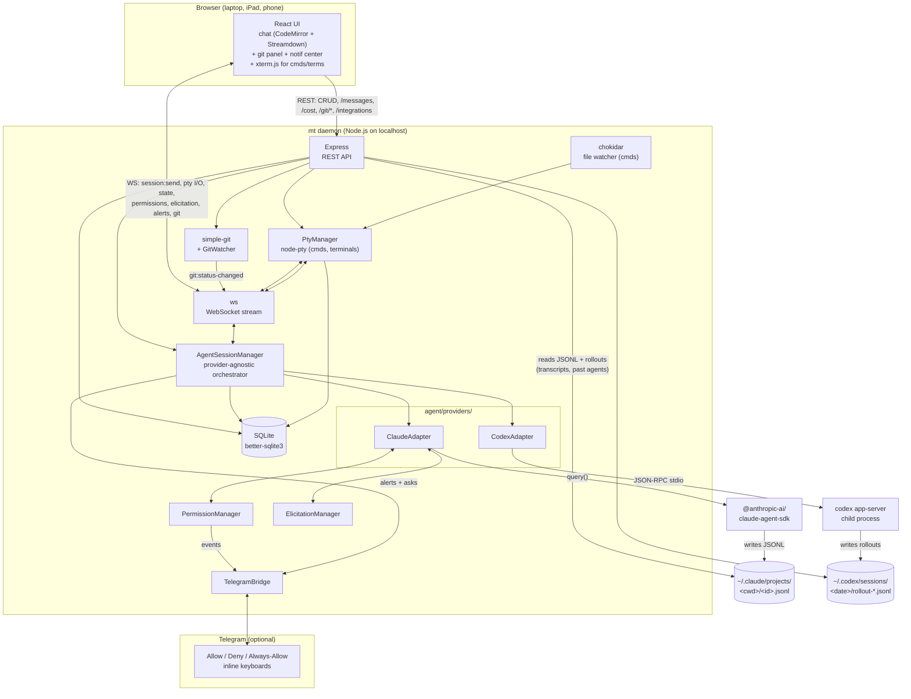

<p align="center">
  <!-- Drop a logo at docs/images/logo.png (512x512 PNG recommended). -->
  
</p>

<h1 align="center">MultiTable</h1>

<p align="center">
  <em>One cockpit for every AI coding agent, dev server, and terminal in your workflow.</em><br/>
  <sub>Because <code>tmux</code> wasn't built for the day Claude, Codex, Aider, and <code>npm run dev</code> all need your attention at once.</sub>
</p>

<p align="center">
  <a href="LICENSE"></a>
  
  
  
  
  <a href="https://github.com/erickalfaro/multitable/actions"></a>
</p>

<p align="center">
  <!-- Record a 15–30s screen cap with asciinema or kap, save as docs/images/demo.gif -->
  
</p>

---

## What is this?

MultiTable is a **local, browser-based dashboard** for the chaos of agentic coding. A small Node.js daemon on your machine drives **multiple AI agents** — Claude Code through the [Claude Agent SDK](https://www.npmjs.com/package/@anthropic-ai/claude-agent-sdk) and OpenAI Codex through direct JSON-RPC against the [`codex app-server`](https://github.com/openai/codex) child process — spawns dev servers and shells via real PTYs (thanks, [`node-pty`](https://github.com/microsoft/node-pty)), persists state in SQLite, and serves a React UI at `http://localhost:3000`. One tab. Every project. Every agent. Every dev server. Optionally: approve permission prompts from your phone over Telegram.

**Agents are SDK-driven, not terminal-driven.** Both Claude Code and Codex render as a sleek chat UI — markdown, syntax-highlighted code, collapsible tool calls, live chain-of-thought, inline permission cards, schema-driven elicitation forms, `/` slash commands and `@file` mentions in the composer. No xterm screen-scraping. Commands (dev servers, queue workers) and terminals (ad-hoc shells) still run on real PTYs because that's the right model for them.

**Privacy:** the daemon runs entirely on your machine. No accounts, no telemetry, no outbound calls — except to the LLM providers you've signed in to (and to Telegram if you opt in). Network traffic is between your browser and `localhost` (or your tailnet, if you turn that on).

```
Before MultiTable                      After MultiTable
┌──────┐ ┌──────┐ ┌──────┐             ┌──────────────────────────────┐
│Claude│ │ Codex│ │ npm  │             │  MultiTable (one tab)        │
│ Code │ │      │ │ dev  │             │                              │
└──────┘ └──────┘ └──────┘             │  All processes. One view.    │
┌──────┐ ┌──────┐ ┌──────┐             │  Status at a glance.         │
│Queue │ │ Logs │ │ bash │             │  Auto-restart on crash.      │
│worker│ │      │ │      │             │  Approve perms in the UI.    │
└──────┘ └──────┘ └──────┘             └──────────────────────────────┘
 6+ scattered terminals                  1 tab, everything managed
```

## Why you might want it

- You run **more than one coding agent** at a time (Claude Code + Codex + Aider...) and lose track of which terminal is which.
- Your Claude Code session throws a **permission prompt** while you're on another tab and the run stalls for 30 minutes.
- Your **dev server crashes**, silently, inside one of twelve tmux panes.
- You want to check on a running agent from your **iPad in the kitchen** over Tailscale.
- You want **cost and token usage** per session without scraping logs.

## Why I built this

I wanted to vibe-code from my phone.

Not "SSH into a box and squint at vim" — Termux has done that for years and it's miserable. I wanted the real thing: a proper file explorer, real terminals, status at a glance for every running agent and dev server, and the ability to approve a Claude Code permission prompt from the couch without losing context. I wanted to kick off half a dozen experiments across different repos in the morning and check on each one between meetings.

Nothing existed that did all that, so I built MultiTable.

## Code from anywhere

The daemon runs on your dev machine. The UI runs in any browser. Stretch one over [Tailscale](https://tailscale.com) and your dev environment goes wherever you do — phone on the train, iPad on the couch, borrowed laptop at a coffee shop. Same projects, same agents, same scrollback, same git diffs. You can kick off a Claude Code session from your desktop, leave the house, approve its permission prompts from your phone, and read the diff it produced on your iPad while you make dinner.

Nothing leaves your machine. Tailscale handles the encrypted tunnel; MultiTable just listens on a port. No cloud sync, no relay server, no account.

```yaml
# ~/.config/multitable/config.yml
host: 0.0.0.0   # bind to your tailnet, not the public internet
```

Then open `http://<your-tailscale-hostname>:3000` from any device on the tailnet. That's it.

## Features

- **Multi-provider, not just Claude.** Claude Code via the official [Claude Agent SDK](https://www.npmjs.com/package/@anthropic-ai/claude-agent-sdk); Codex via direct JSON-RPC to `codex app-server` (no PTY screen-scraping, no `@openai/codex-sdk` dependency). Both render in the same chat UI; both feed the same permission, diff, and notification plumbing. `Gemini` and `Copilot` are scaffolded for future drop-in adapters.
- **Sleek chat UI for every agent.** A CodeMirror composer with `@file` mentions, `/` slash commands, image attachments, and an expandable full-screen draft mode. The chat history streams markdown (Streamdown), shiki-highlighted code, collapsible tool-call cards, **live chain-of-thought**, and **live task lists**. No more peering at a terminal pretending to be a chat.
- **One sidebar, every process.** Agents (AI, SDK-driven), commands (dev servers, workers, PTY-driven), and terminals (ad‑hoc shells, PTY-driven) in a single tree, grouped by project. A 60-variant dot-matrix avatar set keeps projects visually distinct.
- **Permission prompts surface in the UI — and on Telegram.** Allow / Deny / Always-Allow buttons render in-line as soon as Claude asks. If you wire up a Telegram bot, the same prompt forwards to your phone with inline keyboard buttons; tap a button, the answer flows back to your daemon and resolves the SDK's `canUseTool` Promise. No relay server, no cloud sync — your daemon talks directly to the Bot API.
- **Elicitation forms.** MCP-style schema prompts (think: "the server needs this structured input from the user") render as a real form in the UI, type-aware, with enum dropdowns and defaults.
- **Modes per agent.** `default`, `plan`, `accept-edits`, `auto`, `chat`, `read-only` — each provider translates appropriately (Claude → `permissionMode`; Codex → sandbox + thread reset, because Codex options are immutable after thread start).
- **`@file` mentions and `/` slash commands** in the composer. Fuzzy file picker over your project tree; `/clear` and `/cost` are intercepted client-side; user-defined `.claude/commands/*.md` flow through the SDK as templated prompts.
- **Live cost & token tracking** per agent, surfaced from the SDK's `result` message — no log scraping. (Codex doesn't currently report USD, so the dollar row is hidden for Codex sessions.)
- **Live model picker.** Discovered live via `codex debug models` + Anthropic `/v1/models`, with fallback to canonical aliases. Switch models per agent.
- **Past Agents browser.** Resume any past Claude or Codex thread from disk. Claude JSONL at `~/.claude/projects/<encoded-cwd>/<id>.jsonl` and Codex rollouts at `~/.codex/sessions/<YYYY>/<MM>/<DD>/rollout-<ts>-<thread_id>.jsonl` are both parsed into the same `Message[]` shape — full interop with both CLIs.
- **Full git panel, not just diffs.** Status, staging, commit composer, branch picker, branch create/switch/delete, stash/pop, fetch/pull/push — per project, live-updated by a `chokidar` watcher + `simple-git`. Each agent gets a `git_baseline_commit` on creation, so you can also see exactly what *that agent* changed.
- **Notification center + browser/audio alerts.** Per-category + per-severity prefs, OS notifications, tab badges for unread, and an in-app history with severity icons and dismiss controls.
- **Dev log panel.** Daemon-side timers, WS, permission, and adapter events stream into an in-app debug panel — pause, search, replay. Saves a lot of tail-ing.
- **Auto-restart with backoff** for commands. Configurable `autorestartMax`, `autorestartDelayMs`, and windowed reset — crashes don't mean silence.
- **File-watch restart** for dev servers — edit `src/**/*.ts`, the watcher restarts the right process.
- **Command palette** (`cmdk`) for fuzzy-jumping between projects, processes, and actions.
- **SQLite persistence.** Projects, sessions, commands, scrollback (commands/terminals only) — all survive restarts.
- **LAN / Tailscale / mobile.** Bind the daemon to `0.0.0.0`, open the UI from your phone or iPad — same dashboard, with a touch toolbar.
- **Themeable.** Built-in light/dark themes plus user-defined themes via CSS variables.
- **Config-as-code.** Drop an `mt.yml` in a project and everything autostarts the way you described.

## How it compares

|                       | tmux / zellij | Warp / Wave | **MultiTable** |
|-----------------------|---------------|-------------|----------------|
| Multiple PTYs         | ✅            | ✅          | ✅             |
| Survives reboot       | ⚠️ session files | ❌       | ✅ SQLite     |
| Per-process auto-restart | ❌         | ❌          | ✅             |
| File-watch restart    | ❌            | ❌          | ✅             |
| Agent in a chat UI (not a terminal) | ❌ | ❌      | ✅ (Claude SDK + Codex JSON-RPC) |
| **Multiple agent providers in one UI (Claude + Codex)** | ❌ | ❌ | ✅ |
| Agent permission prompts in UI | ❌   | ❌          | ✅             |
| **Approve permission prompts from your phone (Telegram)** | ❌ | ❌ | ✅ |
| Live cost / token tracking | ❌       | ❌          | ✅             |
| **Live model picker per agent** | ❌    | ❌          | ✅             |
| `@file` and `/` slash commands in composer | ❌ | ❌  | ✅             |
| **Full in-UI git workflow (stage / commit / branch / stash)** | ❌ | ❌ | ✅ |
| Use from your phone   | ❌            | ❌          | ✅             |
| 100% local, no account | ✅           | ❌          | ✅             |

## "Isn't this just OpenClaw?"

No — different tool, different problem. The two are genuinely complementary.

[OpenClaw](https://github.com/openclaw/openclaw) is a personal AI agent you talk to through messaging apps (WhatsApp, Telegram, Slack…) that runs skills on your behalf. One of its many skills can delegate work to Claude Code or Codex.

MultiTable is the cockpit for those coding agents. You're watching the actual PTY, scrubbing the scrollback, approving the permission prompts in-line, reading the git diff per session. OpenClaw dispatches work to an agent; MultiTable lets you sit in front of the agent and steer it.

Use OpenClaw when you want to message an assistant from your phone and have it go do things. Use MultiTable when you want to *be* the operator — see every running session, every prompt, every line of output — just from a browser instead of a wall of terminals. There's no reason you can't run both.

A few deliberate scope choices that follow from this framing:

- **Localhost-only by default** (`127.0.0.1`). LAN / Tailscale access is one config line away, but the default is not a public bind.
- **No plugin or skill registry.** MultiTable runs the processes you explicitly spawn. There's no marketplace of community code that auto-loads into your daemon.
- **Coding-loop only.** No messaging bridges, no smart-home control, no general-purpose skill catalog. Every screen is built around dev-loop primitives: sessions, dev servers, terminals, diffs.

## Screenshots

> 📸 Drop screenshots into `docs/images/` and these will render.

| Dashboard | Session detail |
|---|---|
|  |  |

| Terminal view | Permission request |
|---|---|
|  |  |

<details>
<summary>ASCII preview (for repo readers without images)</summary>

```
┌──────────────┬───────────────────────────────────────────────┐
│  SIDEBAR     │  MAIN PANE                                    │
│              │                                               │
│  my-project  │  $ claude                                     │
│   SESSIONS   │  > I'll help you refactor the API...          │
│   ● Claude   │  Reading src/api/routes.ts...                 │
│   ● Codex    │  █                                            │
│   TERMINALS  │                                               │
│   ● Term 1   │  ┌─ Permission Request ─────────────────┐     │
│   COMMANDS   │  │ Claude Code wants to use: Edit       │     │
│   ● npm:dev  │  │ File: src/api/routes.ts              │     │
│   ● Queue    │  │ [Allow]  [Deny]  [Always Allow]      │     │
│              │  └──────────────────────────────────────┘     │
├──────────────┴───────────────────────────────────────────────┤
│ [Focus][Pause][Clear][Stop][Restart]   CPU 2.1%  MEM 43MB   │
└──────────────────────────────────────────────────────────────┘
```

</details>

---

## Installation

MultiTable is pre-npm-publish — you install it from source. All three platforms follow the same three-step dance:

1. **Install prerequisites** (Node + build tools for native modules).
2. **Clone + install + build**.
3. **Link the `mt` CLI** so you can run `mt start` from anywhere.

### Prerequisites (all platforms)

- **Node.js ≥ 18** — <https://nodejs.org/> (LTS is fine)
- **npm ≥ 9** (ships with Node 18+)
- **Git**

> **Why native build tools?** MultiTable depends on `better-sqlite3` and `node-pty`, which are native C/C++ modules. `npm install` will attempt to download prebuilt binaries; if none exist for your platform/Node version, it falls back to building from source and will need a compiler.

### 🍎 macOS

```bash
# 1. Install Xcode Command Line Tools (for native module builds)
xcode-select --install

# 2. Clone, install, build
git clone https://github.com/erickalfaro/multitable.git
cd multitable
npm install
npm run build

# 3. Make `mt` available globally
cd packages/cli && npm link && cd ../..
```

### 🐧 Linux (Debian / Ubuntu)

```bash
# 1. Install build tools
sudo apt-get update
sudo apt-get install -y build-essential python3 git

# 2. Clone, install, build
git clone https://github.com/erickalfaro/multitable.git
cd multitable
npm install
npm run build

# 3. Make `mt` available globally
cd packages/cli && sudo npm link && cd ../..
```

On **Fedora / RHEL**: replace step 1 with `sudo dnf install -y gcc-c++ make python3 git`.
On **Arch**: `sudo pacman -S --needed base-devel python git`.

### 🪟 Windows 10 / 11

**Use PowerShell, not `cmd.exe`.** A few of the npm scripts rely on Unix-ish shell idioms (`cp`), which PowerShell aliases but `cmd.exe` does not.

```powershell
# 1. When installing Node from nodejs.org, check the box:
#    "Automatically install the necessary tools for native modules"
#    (That pulls Visual Studio Build Tools + Python 3 via Chocolatey.)

# 2. Clone, install, build
git clone https://github.com/erickalfaro/multitable.git
cd multitable
npm install
npm run build

# 3. Make `mt` available globally
cd packages\cli
npm link
cd ..\..
```

> **Known Windows limitation:** per-process CPU % shows as `0` on Windows (the metrics poller uses Unix `ps` as a fallback). Memory and state work normally. PR welcome.

### Uninstall

```bash
cd multitable/packages/cli && npm unlink -g
cd ../.. && rm -rf node_modules
rm -rf ~/.config/multitable       # config
rm -rf ~/.local/share/multitable  # SQLite db, scrollback (Linux/macOS path)
```

---

## Quick start

```bash
mt start          # start the daemon on http://localhost:3000
mt open           # open the UI in your browser
```

…or skip the CLI and run dev mode (daemon + Vite with HMR):

```bash
npm run dev
# Daemon:      http://127.0.0.1:3000
# Vite dev UI: http://127.0.0.1:5173  (proxies /api and /ws to the daemon)
```

From the empty dashboard:

1. Click **+ Add Project** → point it at any directory on disk.
2. Add an **agent** (Claude Code or Codex are both first-class — pick a provider, model, and mode) or a command (`npm run dev`).
3. Send your first prompt — the agent auto-starts. (Or add a command and hit **Start**.)
4. Grab a drink.

## Configure a project with `mt.yml`

Drop this at the root of any project and MultiTable will pick it up on startup:

```yaml
name: my-project
sessions:
  - name: Claude Code
    command: claude
    autostart: true
commands:
  - name: npm:dev
    command: npm run dev
    autostart: true
    fileWatchPatterns:
      - "src/**/*.ts"
  - name: Queue
    command: php artisan queue:work
    autostart: true
    autorestart: true
    autorestartMax: 5
    autorestartDelayMs: 2000
```

## Global daemon config

`~/.config/multitable/config.yml` (Linux/macOS) — or the equivalent on Windows via [`env-paths`](https://github.com/sindresorhus/env-paths):

```yaml
port: 3000
host: 127.0.0.1   # change to 0.0.0.0 to accept LAN / Tailscale connections
```

## Remote access setup

See [Code from anywhere](#code-from-anywhere) above for the why. The full recipe:

1. Install [Tailscale](https://tailscale.com) on your dev machine and on every device you want to reach it from. Sign in to the same tailnet on each.
2. Set `host: 0.0.0.0` in `~/.config/multitable/config.yml` and restart the daemon.
3. Find your dev machine's tailnet name (`tailscale status` shows it) and open `http://<tailscale-hostname>:3000` from any device on the tailnet.

A few things worth noting:

- **Don't bind to `0.0.0.0` without Tailscale** unless you know what you're doing. The daemon has no auth — anything on your network can reach it.
- **Mobile UI is responsive** — there's a touch toolbar and a swipe-out sidebar built specifically for phone-sized screens.
- **WebSocket reconnects automatically** when you switch networks (Wi-Fi → cellular and back), so you can walk out the door mid-session.

---

## Architecture



See [`docs/SPEC.md`](docs/SPEC.md) for the full product specification, [`docs/OVERVIEW.md`](docs/OVERVIEW.md) for a deeper visual walkthrough, [`docs/SDK_MIGRATION_PLAN.md`](docs/SDK_MIGRATION_PLAN.md) for the rewrite that moved sessions from PTY to SDK, [`docs/CODEX_APP_SERVER_MIGRATION.md`](docs/CODEX_APP_SERVER_MIGRATION.md) for the move from the npm SDK to direct app-server JSON-RPC, and [`docs/THREE_PROVIDER_INTEGRATION_PLAN.md`](docs/THREE_PROVIDER_INTEGRATION_PLAN.md) for the multi-provider design.

## Repository layout

```
packages/
  daemon/   Node.js backend — Express + ws + node-pty + claude-agent-sdk + codex app-server + SQLite
    src/agent/             AgentSessionManager (provider-agnostic) + sdkAdapter + streamBuffer + alerts
    src/agent/providers/   ClaudeAdapter, CodexAdapter, codex-app-server transport/client, codex-protocol bindings
    src/pty/               PtyManager (commands + terminals only)
    src/hooks/             permissionManager, elicitationManager, costParser, labeler, optionDetector
    src/notifications/     Telegram bridge (telegramBridge + telegramApi + telegramFormat)
    src/git/               simple-git wrappers + chokidar GitWatcher
    src/transcripts/       Claude JSONL parser + Codex rollout parser
    src/api/               REST routers (projects, sessions, commands, terminals, processes,
                           config, search, transcripts, notes, integrations, git, providers)
    src/devLog.ts, src/loaders.ts, src/config/secrets.ts
  web/      React frontend
    src/components/main-pane/chat/   SessionChat + 14 chat subcomponents (CodeMirror composer,
                                     ExpandedComposer, ModelChip, ReasoningCard, LoaderNode,
                                     ToolCallCard, TurnRow, ChatScroller, TasksTab, …)
    src/components/main-pane/git/    Full git panel (GitPanel, GitFileList, GitDiffPane,
                                     GitBranchPicker, GitCommitComposer, DiffFileSection)
    src/components/elicitation/      ElicitationModal (schema-driven forms)
    src/components/notifications/    NotificationCenter
    src/components/dev-log/          DevLogPanel
    src/components/sidebar/          PastAgentsList (replaces old PastSessions), Sidebar items
    src/components/ui/dotmatrix-*    60-variant project loader/avatar system
    src/lib/                         ws, api, notify, devLog, markdown, notificationPrefs, pastAgents, …
  cli/      `mt` command (commander)
docs/       SPEC, OVERVIEW, SDK_MIGRATION_PLAN, CODEX_APP_SERVER_MIGRATION,
            THREE_PROVIDER_INTEGRATION_PLAN
```

## Roadmap

- [x] **v0.1** Foundation — daemon + React + single terminal + projects
- [x] **v0.2** Persistence — SQLite + dashboard + status indicators
- [x] **v0.3** Git tools — diff viewer per session
- [x] **v0.4** Claude Code integration — hooks, in-UI permissions, options, resume, cost & token tracking
- [x] **v0.5** Chat UI for sessions — CodeMirror composer, markdown + shiki rendering, collapsible tool cards
- [x] **v0.6** SDK migration — sessions driven by `@anthropic-ai/claude-agent-sdk` (no PTY for sessions); `@file` mentions and `/` slash commands
- [x] **v0.7** Multi-provider architecture — `ProviderAdapter` contract; Codex as a first-class adapter via `codex app-server` JSON-RPC (no PTY, no `@openai/codex-sdk`); live reasoning + tool deltas; modes per agent
- [x] **v0.8** Remote + workflow polish — Telegram bridge for permission prompts; full in-UI git workflow (stage / commit / branch / stash); notification center with per-category prefs; elicitation forms; live model picker; Past Agents browser; in-app DevLog panel
- [ ] **v0.9** Global keyboard shortcuts (`Ctrl+K` palette, process jumps), richer search, more provider adapters (Gemini, Copilot scaffolding exists), packaged binaries

## Contributing

Contributions of all sizes welcome — bug reports, docs fixes, entire features. See [`CONTRIBUTING.md`](CONTRIBUTING.md).

Good first issues are labelled `good first issue`. The most useful early PRs would be:

- **Global keyboard shortcuts** (the command palette opens, but nothing has bound `Ctrl+K` yet).
- **Windows per-process CPU %** (the metrics poller currently relies on Unix `ps`).
- **More native slash commands** (`/model`, `/compact`, `/init` etc. — currently only `/clear` and `/cost` are intercepted; the rest get sent to the SDK as plain text and don't do their CLI thing).
- **Adapters for additional providers** (Gemini, Aider, Copilot — the `ProviderAdapter` contract under `packages/daemon/src/agent/providers/` is stable; drop in a new file alongside `claude.ts` and `codex.ts` and register it in the manager).
- **Packaged binaries** for `mt` so installation doesn't require the Node toolchain.

## Security

Please **don't open public issues** for vulnerabilities. See [`SECURITY.md`](SECURITY.md).

## License

MIT — see [`LICENSE`](LICENSE).

---

<p align="center"><sub>Built with the Claude Agent SDK, codex app-server, node-pty, React, CodeMirror, SQLite, and a healthy refusal to tmux one more thing.</sub></p>
